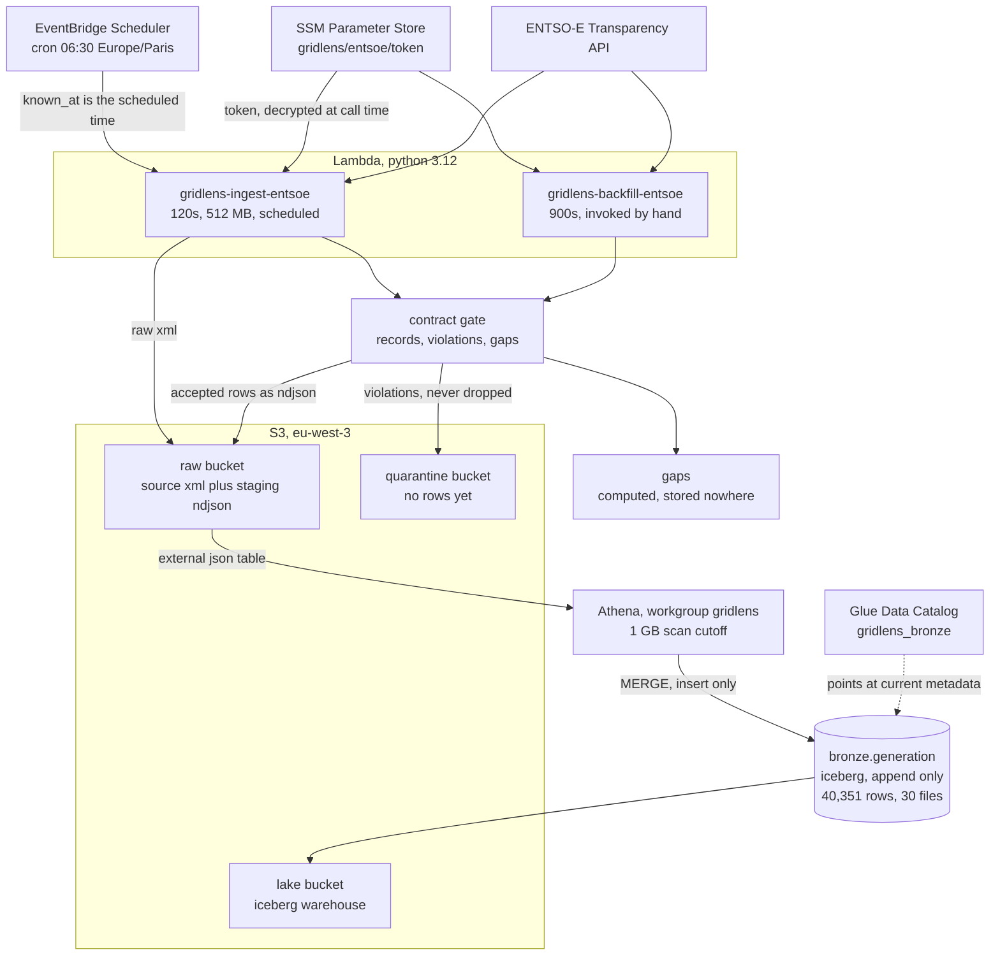
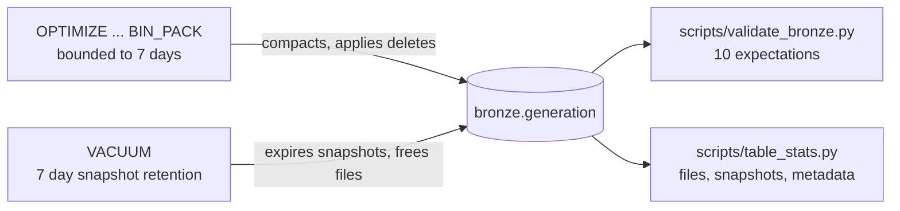

# Architecture

What runs today, drawn from the deployed resources rather than the plan. The
target architecture for the whole project is wider than this and most of it
does not exist yet, so it is a list at the bottom rather than boxes in the
diagram.

## What runs today

The path is deliberately boring. A Lambda fetches one settlement day, the
contract gate splits the parse three ways, accepted rows are staged as
newline-delimited json in the raw bucket, and Athena merges that batch into
Iceberg. Around 1,400 rows a morning.

Three details in that picture carry most of the design.

**`known_at` comes from the scheduler**, not from the clock inside the
function. EventBridge substitutes its scheduled time into the payload and that
value is identical across every retry of one firing, so a retry merges onto the
rows the first attempt wrote instead of inserting them again under a fresh
timestamp.

**The merge has no `WHEN MATCHED` clause.** Bronze never updates. A retry
inserts nothing, and a day whose values have not changed inserts nothing
either, because a subquery drops staged rows matching the newest version
already held.

**Gaps go nowhere on purpose.** The gate treats a period the source did not
publish as a third outcome, neither a record nor a violation, and does not
decide what it means. Baking that guess into an append-only table would make it
permanent, so it is a silver decision that has not been made yet.

## Operations run against the table

None of these are scheduled. They are run by hand until Airflow lands on day
15.

## How it is built and deployed

Terraform in two stacks, `bootstrap` for the state bucket and the budget,
`core` for everything else. GitHub Actions runs ruff, mypy, 161 tests, the
writing style check, a linux rebuild of the Lambda bundle, and `terraform plan`
against the real account through OIDC. No AWS keys exist in the repository or
its secrets.

The Lambda bundle is byte for byte reproducible. CI rebuilds it on Linux and
`terraform plan` has to then report no changes, which has caught three real
defects.

## Not built yet

In dependency order, with the day each is planned for. Nothing above references
any of it.

- Airflow on Docker Compose, orchestrating ingest, quality and backfill, 15
- dbt-athena project, sources and staging models, 16
- Bitemporal silver, `current` and `as_of(t)`, 17
- Gold marts and a run manifest of git SHA, snapshot ids and factor version, 18
- Restatement audit, re-run last month and assert identical output, 20
- Redpanda and a producer, 22
- Spark Structured Streaming consumer with watermarks and dedupe, 23
- Reconciliation of the stream against the batch, and a divergence metric, 24
- Prometheus and Grafana on freshness, completeness and revision lag, 25
- OpenLineage into Marquez, 26
- Chaos suite, five fault injection scenarios, 27
- `/signal/now` and `/restate` on a Lambda Function URL, 28
- EMR Serverless scale validation, run once and torn down, 29

RTE sits outside that list because it is a special case. The client and
normalizer are written and tested, they produce the same row shape, and nothing
schedules them. Until that changes, the reconciliation on day 24 has only one
source to reconcile.
