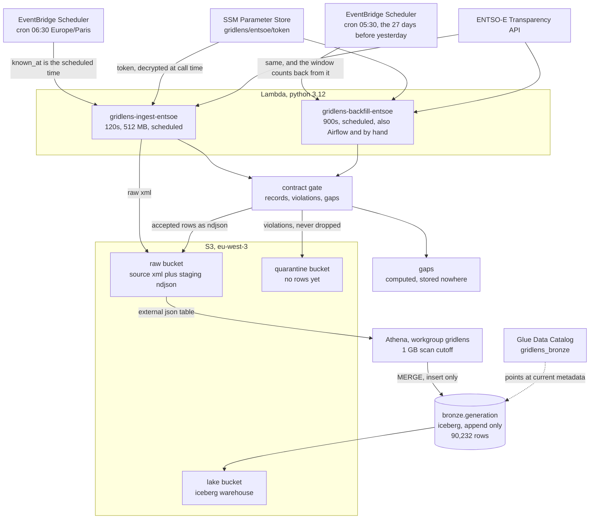
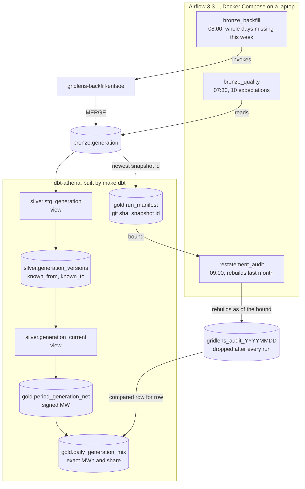
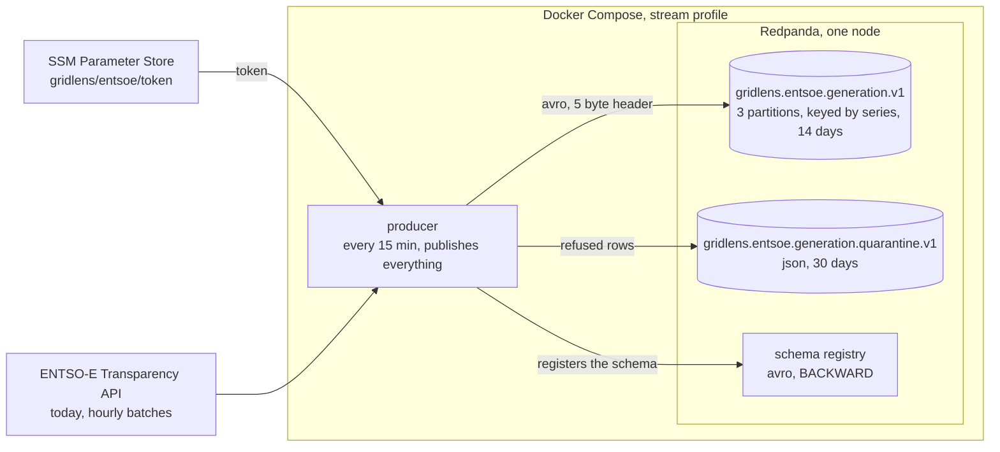
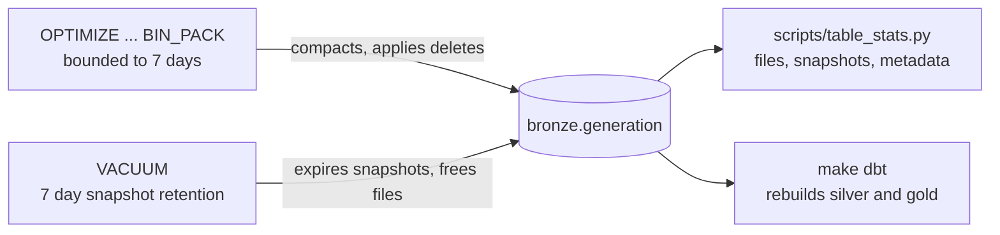

# Architecture

What runs today, drawn from the deployed resources rather than the plan. The
target architecture for the whole project is wider than this and the rest of
it does not exist yet, so it is a list at the bottom rather than boxes in the
diagrams. Figures as of 2026-10-05.

## Ingest

```mermaid
flowchart TD
    entsoe["ENTSO-E Transparency API"]
    ssm["SSM Parameter Store<br/>gridlens/entsoe/token"]
    sched["EventBridge Scheduler<br/>cron 06:30 Europe/Paris"]
    refetch["EventBridge Scheduler<br/>cron 05:30, the 27 days before yesterday"]

    subgraph lambda["Lambda, python 3.12"]
        ingest["gridlens-ingest-entsoe<br/>120s, 512 MB, scheduled"]
        backfill["gridlens-backfill-entsoe<br/>900s, scheduled, also Airflow and by hand"]
    end

    gate["contract gate<br/>records, violations, gaps"]
    gaps["gaps<br/>computed, stored nowhere"]

    subgraph s3["S3, eu-west-3"]
        raw["raw bucket<br/>source xml plus staging ndjson"]
        quarantine["quarantine bucket<br/>no rows yet"]
        lake["lake bucket<br/>iceberg warehouse"]
    end

    athena["Athena, workgroup gridlens<br/>1 GB scan cutoff"]
    glue["Glue Data Catalog<br/>gridlens_bronze"]
    bronze[("bronze.generation<br/>iceberg, append only<br/>90,232 rows")]

    sched -->|"known_at is the scheduled time"| ingest
    refetch -->|"same, and the window counts back from it"| backfill
    ssm -->|"token, decrypted at call time"| ingest
    ssm --> backfill
    entsoe --> ingest
    entsoe --> backfill
    ingest -->|"raw xml"| raw
    ingest --> gate
    backfill --> gate
    gate -->|"violations, never dropped"| quarantine
    gate --> gaps
    gate -->|"accepted rows as ndjson"| raw
    raw -->|"external json table"| athena
    athena -->|"MERGE, insert only"| bronze
    bronze --> lake
    glue -.->|"points at current metadata"| bronze
```

The path is deliberately boring. A Lambda fetches one settlement day, the
contract gate splits the parse three ways, accepted rows are staged as
newline-delimited json in the raw bucket, and Athena merges that batch into
Iceberg. Around 1,400 rows a morning.

Four details in that picture carry most of the design.

**`known_at` comes from the scheduler**, not from the clock inside the
function. EventBridge substitutes its scheduled time into the payload and that
value is identical across every retry of one firing, so a retry merges onto the
rows the first attempt wrote instead of inserting them again under a fresh
timestamp.

**The merge has no `WHEN MATCHED` clause.** Bronze never updates. A retry
inserts nothing, and a day whose values have not changed inserts nothing
either, because a subquery drops staged rows matching the newest version
already held.

**Every recent day is fetched again every morning.** The ingest fetches
yesterday once. A second schedule re-fetches the 27 days before that through
the backfill Lambda, and the merge keeps only values that changed. Until
2026-10-05 nothing did this, and bronze looked as though ENTSO-E almost never
revises. ADR-0007 has the numbers.

**Gaps go nowhere on purpose.** The gate treats a period the source did not
publish as a third outcome, neither a record nor a violation, and does not
decide what it means. Baking that guess into an append-only table would make it
permanent.

## Silver, gold and the checks around them

```mermaid
flowchart TD
    bronze[("bronze.generation")]

    subgraph dbt["dbt-athena, built by make dbt"]
        stg["silver.stg_generation<br/>view"]
        versions[("silver.generation_versions<br/>known_from, known_to")]
        current["silver.generation_current<br/>view"]
        period[("gold.period_generation_net<br/>signed MW")]
        daily[("gold.daily_generation_mix<br/>exact MWh and share")]
        manifest[("gold.run_manifest<br/>git sha, snapshot id")]
    end

    subgraph airflow["Airflow 3.3.1, Docker Compose on a laptop"]
        quality["bronze_quality<br/>07:30, 10 expectations"]
        filler["bronze_backfill<br/>08:00, whole days missing this week"]
        audit["restatement_audit<br/>09:00, rebuilds last month"]
    end

    backfill["gridlens-backfill-entsoe"]
    scratch[("gridlens_audit_YYYYMMDD<br/>dropped after every run")]

    bronze --> stg --> versions --> current --> period --> daily
    bronze -.->|"newest snapshot id"| manifest
    quality -->|"reads"| bronze
    filler -->|"invokes"| backfill
    backfill -->|"MERGE"| bronze
    manifest -->|"bound"| audit
    audit -->|"rebuilds as of the bound"| scratch
    scratch -->|"compared row for row"| daily
```

Silver turns versions into intervals, so reading the past is a range
predicate. Gold nets storage once and converts power to energy. The manifest
records which commit built each run and which bronze snapshot it read.

Airflow does not own the ingest. EventBridge does, and replacing a scheduler
that works with one that is a day old is how you get a second outage. Airflow
runs the checks and repairs nothing else was running, and it only runs them
while the laptop it lives on is switched on.

The audit compares three tables, `generation_versions`,
`period_generation_net` and `daily_generation_mix`, not only the daily one.
The diagram draws one arrow to keep it readable. `docs/restatement.md` has the
steps.

## The stream

```mermaid
flowchart LR
    entsoe["ENTSO-E Transparency API<br/>today, hourly batches"]
    ssm["SSM Parameter Store<br/>gridlens/entsoe/token"]

    subgraph compose["Docker Compose, stream profile"]
        producer["producer<br/>every 15 min, publishes everything"]
        subgraph redpanda["Redpanda, one node"]
            obs[("gridlens.entsoe.generation.v1<br/>3 partitions, keyed by series, 14 days")]
            quar[("gridlens.entsoe.generation.quarantine.v1<br/>json, 30 days")]
            registry["schema registry<br/>avro, BACKWARD"]
        end
    end

    ssm -->|"token"| producer
    entsoe --> producer
    producer -->|"avro, 5 byte header"| obs
    producer -->|"refused rows"| quar
    producer -->|"registers the schema"| registry
```

The stream records what ENTSO-E said and when, every poll, repeats included,
so revisions can be seen as they happen. Nothing consumes it yet. It runs on
the laptop, one compose profile at a time with Airflow.

## Operations run by hand

```mermaid
flowchart LR
    optimize["OPTIMIZE ... BIN_PACK<br/>bounded to 7 days"]
    vacuum["VACUUM<br/>7 day snapshot retention"]
    stats["scripts/table_stats.py<br/>files, snapshots, metadata"]
    build["make dbt<br/>rebuilds silver and gold"]
    bronze[("bronze.generation")]

    optimize -->|"compacts, applies deletes"| bronze
    vacuum -->|"expires snapshots, frees files"| bronze
    bronze --> stats
    bronze --> build
```

None of these are scheduled. Bronze holds 46 snapshots, the oldest from
2026-09-06, and 111 data files across 63 partitions. Its metadata json is 4.7
times the size of the parquet it describes, up from 3.7 the same morning,
because the first re-fetch of recent days committed twelve times. With
revisions now arriving daily, compaction and expiry need a schedule.

## How it is built and deployed

Terraform in two stacks, `bootstrap` for the state bucket and the budget,
`core` for everything else. GitHub Actions runs four jobs on every pull
request:

- `python`: ruff, mypy strict, 221 tests, the writing style check
- `package`: a Linux rebuild of the Lambda bundle
- `terraform`: `terraform plan` against the real account through OIDC
- `dbt`: builds the models a pull request changes, plus their children, in a
  schema of its own, then drops it

No AWS keys exist in the repository or its secrets.

The Lambda bundle is byte for byte reproducible. CI rebuilds it on Linux and
`terraform plan` has to then report no changes, which has caught three real
defects.

## Not built yet

In dependency order, with the day each is planned for. Nothing above references
any of it.

- Spark Structured Streaming consumer with watermarks and dedupe, 23
- Reconciliation of the stream against the batch, and a divergence metric, 24
- Prometheus and Grafana on freshness, completeness and revision lag, 25
- OpenLineage into Marquez, 26
- Chaos suite, five fault injection scenarios, 27
- `/signal/now` and `/restate` on a Lambda Function URL, 28
- EMR Serverless scale validation, run once and torn down, 29

RTE sits outside that list because it is a special case. The client and
normalizer are written and tested, they produce the same row shape, and nothing
schedules them. Until that changes, the reconciliation on day 24 has only one
source to reconcile.
